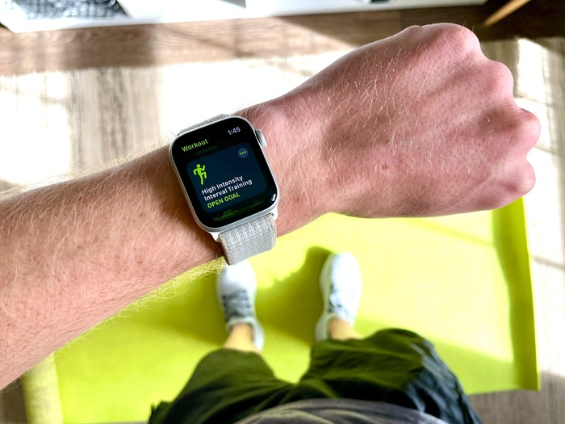
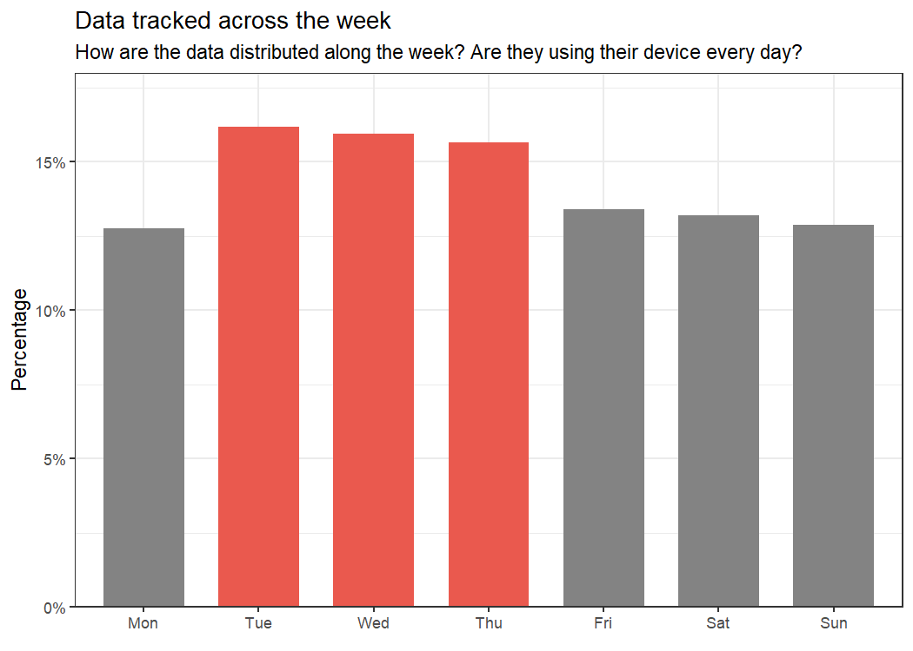
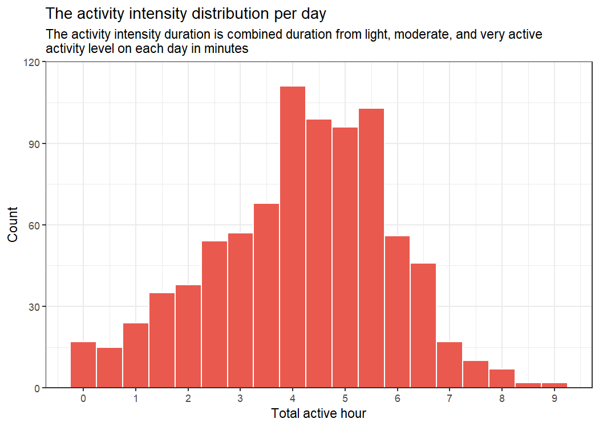
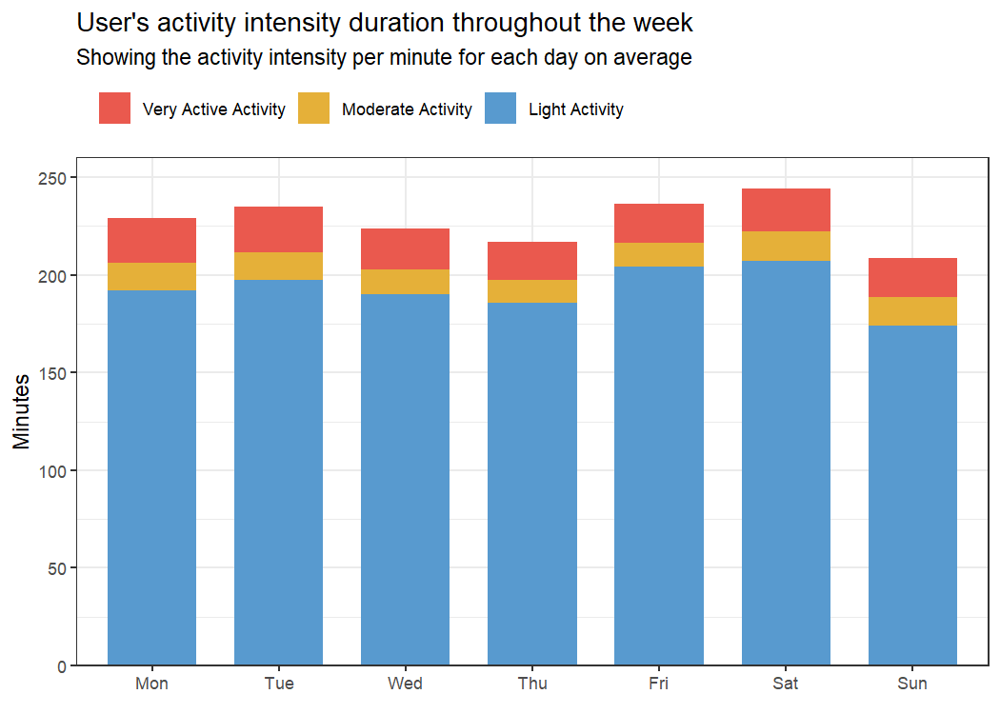
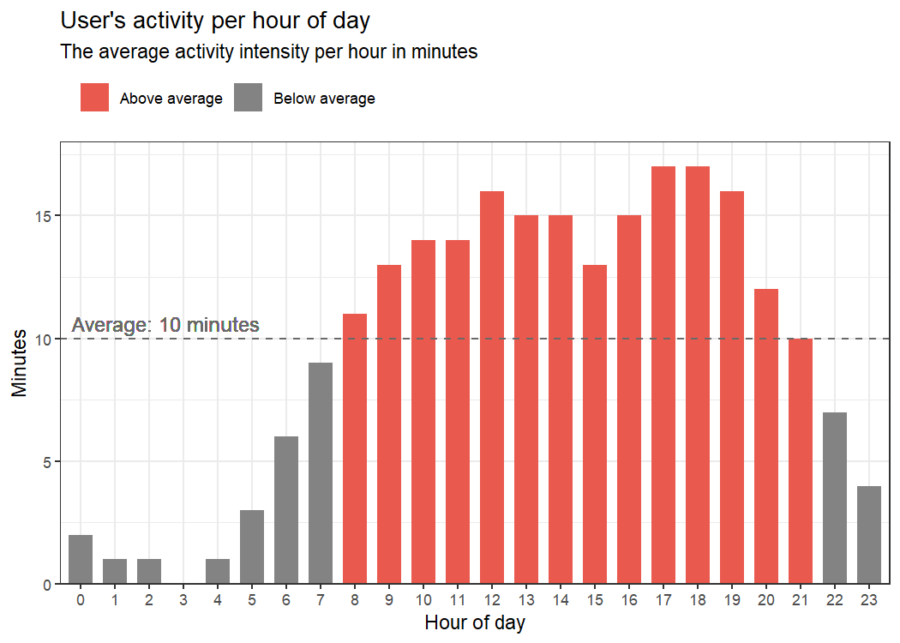
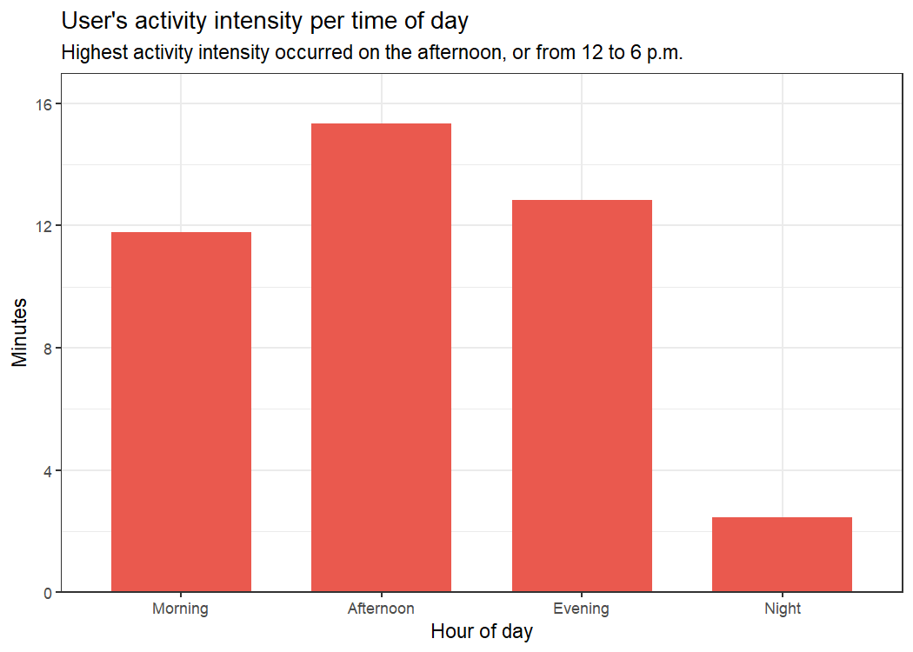
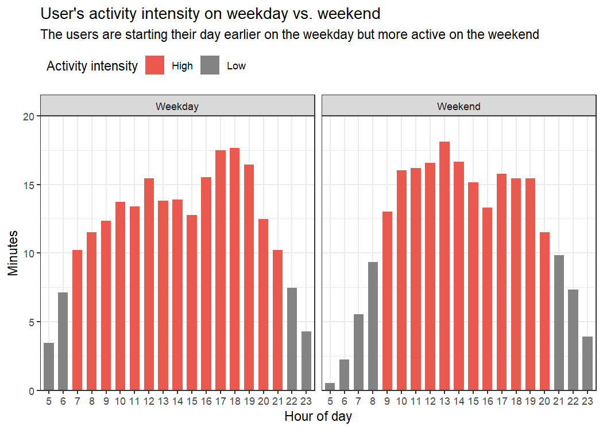
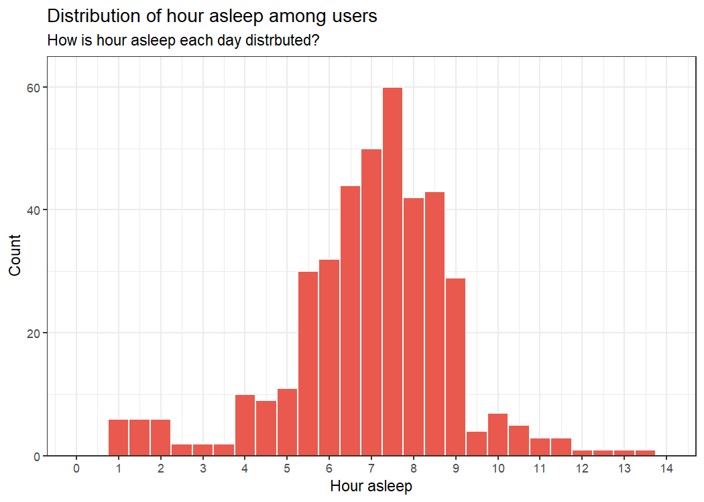
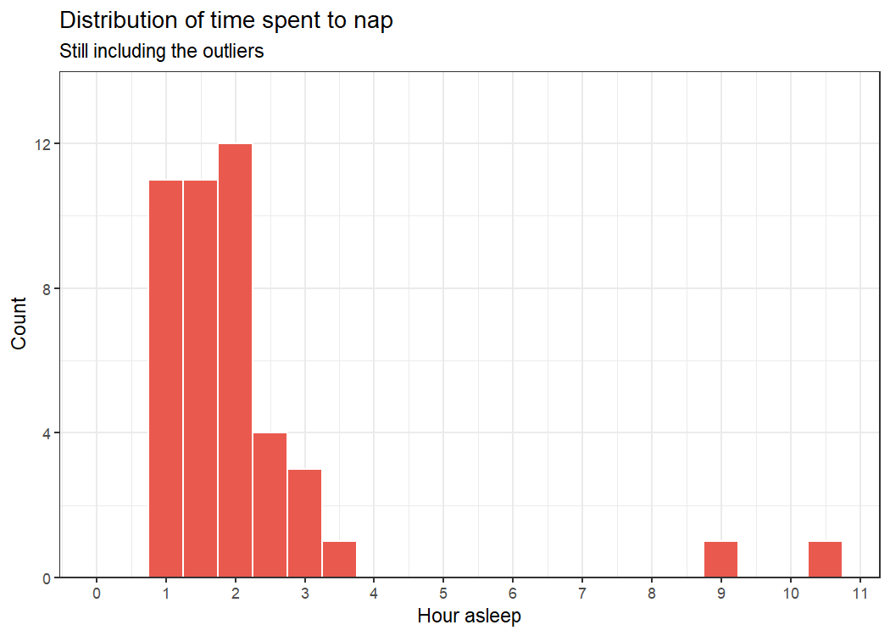
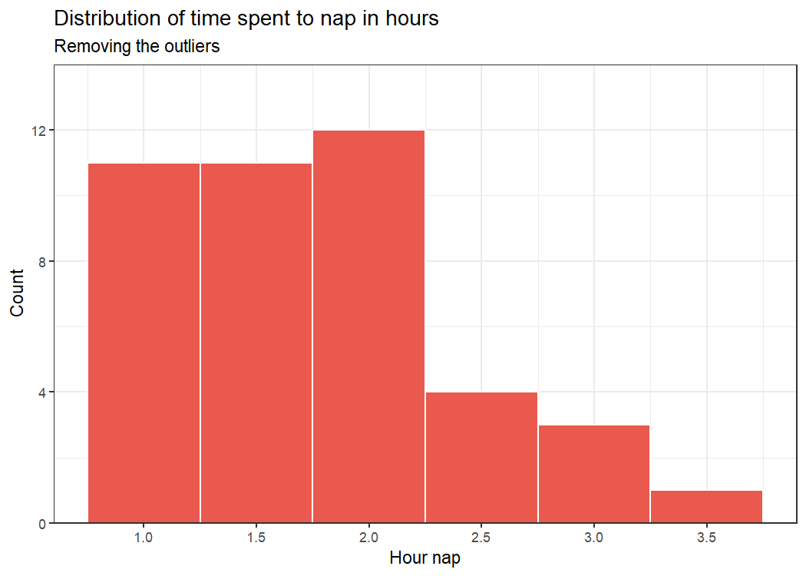

\
:camera: Blocks Fletcher/Unsplash

## Introduction

This project is my attempt to solve the second case study from the
**Google Data Analytics Professional Certificate** **Capstone Projects**
on **Coursera** that you can be accessed
[here](https://www.coursera.org/learn/google-data-analytics-capstone?specialization=google-data-analytics).

This project will be about understanding how people use smart devices to
help with their health and well-being. This knowledge then will be
implemented on products of a smart devices company called **Bellabeat**.
This company aims to manufacture smart devices to help women with their
overall health and well-being.

If you have any questions regarding this project, don’t hesitate to
contact me through email [here](mailto:taufik.achmad.septian@gmail.com),
or send me a message on LinkedIn
[here](https://www.linkedin.com/in/taufik-achmad/).

## Background

Urška Sršen and Sando Mur founded **Bellabeat**, a high-tech company
that manufactures health-focused smart products. Sršen used her
background as an artist to develop beautifully designed technology that
informs and inspires women around the world. Collecting data on
activity, sleep, stress, and reproductive health has allowed Bellabeat
to empower women with knowledge about their health and habits. Since it
was founded in 2013, Bellabeat has grown rapidly and quickly positioned
itself as a tech-driven wellness company for women.

## Business Problem

Sršen knows that an analysis of Bellabeat’s available consumer data
would reveal more growth opportunities. She has asked the marketing
analytics team to focus on a Bellabeat product and analyze smart device
usage data to gain insight into how people are already using their smart
devices. Then, using this information, she would like high-level
recommendations for how these trends can inform Bellabeat marketing
strategy.

Sršen asks you to analyze smart device usage data to gain insight into
how consumers use non-Bellabeat smart devices. These questions will
guide your analysis:

1. **What are some trends in smart device usage?**
2. **How could these trends apply to Bellabeat customers?**
3. **How could these trends help influence Bellabeat marketing
    strategy?**

## Analysis

We’re going to focus on analyzing the sleep and activity level from the
data to keep the result aligned with what Bellabeat’s products measure.

### Data overview

Let’s see how many users we have in our data.

    ## [1] "There are 33 number of unique users in the data."

Also, let’s see what is the interval of time our data is collected.

    ## [1] "2016-04-12 to 2016-05-12"

From our daily level data, there are three variables there, that is
activity, sleep, and weight log. Let’s see how our 33 users tracked
these variables using their devices.

    ## [1] "33 of 33 users tracked their activity level at least once."

    ## [1] "24 of 33 users tracked their sleep at least once."

    ## [1] "8 of 33 users tracked their weight level at least once."

We can see what is the favorable variable the users in our data is more
interested to know about, that is their activity level throughout the
day.

We would also like to see some summary statistics from our data. Let’s
see how our daily tracking data statistics summary looks like.

|                          |   Min |    Mean |  Median |      Max |
|-------------------------:|------:|--------:|--------:|---------:|
|             **Calories** |  0.00 | 2303.61 | 2134.00 |  4900.00 |
|  **FairlyActiveMinutes** |  0.00 |   13.56 |    6.00 |   143.00 |
| **LightlyActiveMinutes** |  0.00 |  192.81 |  199.00 |   518.00 |
|     **SedentaryMinutes** |  0.00 |  991.21 | 1057.50 |  1440.00 |
|      **TotalActiveHour** |  0.00 |    3.79 |    4.12 |     9.20 |
|   **TotalActiveMinutes** |  0.00 |  227.54 |  247.00 |   552.00 |
|      **TotalHourAsleep** |  0.97 |    6.99 |    7.21 |    13.27 |
|   **TotalMinutesAsleep** | 58.00 |  419.17 |  432.50 |   796.00 |
|           **TotalSteps** |  0.00 | 7637.91 | 7405.50 | 36019.00 |
|    **VeryActiveMinutes** |  0.00 |   21.16 |    4.00 |   210.00 |

From the table above, we can conclude several things:

- On average, users are sleeping for about 7 hours each day. Some users
  even sleeping up to 13 hours each day. We will analyze this result
  further because this could happen because they could also took some
  nap and make the value high.

- Each users took about 7600 steps each day on average.

- Looking at the `SedentaryMinutes` variable that tracking the number of
  minutes users are in this activity level, there are users that is not
  performing any particular activities in their day. This can bee seen
  by the max value of this variable that is 1440 minutes or 24 hours.

- On average, each user are active for about 4 hours each day. This
  value can be observed from the `TotalActiveHour` which showing how
  many hours are spent in active state, or combination from light,
  moderate, and very active activity duration.

Before doing any transformation, let’s investigate how is our data
distributed along the week. I would like to see if there are days where
users use their devices more than other days.

| Day | count | percentage | is_high |
|:----|------:|:-----------|:--------|
| Mon |   120 | 13%        | Low     |
| Tue |   152 | 16%        | High    |
| Wed |   150 | 16%        | High    |
| Thu |   147 | 16%        | High    |
| Fri |   126 | 13%        | Low     |
| Sat |   124 | 13%        | Low     |
| Sun |   121 | 13%        | Low     |

Let’s visualize this result to understand the result easier.

<!-- -->

We can see that the data are not distributed equally along the week
where almost half our data alone are generated on Tuesday, Wednesday,
and Thursday. This means, these days are the days where people actively
use their devices.

### Activity level analysis

Before moving into the analysis, let’s first look at is the users in our
data are meeting the
[recommended](https://www.who.int/news-room/fact-sheets/detail/physical-activity#:~:text=Adults%20aged%2018,throughout%20the%20week)
physical activity level, which is 150 minutes of moderate activity or 75
minutes of vigorous-intensity per week.

    ## [1] "23 users achieved the recommended activity level per week."

Now, let’s look at how the activity duration per day from each users are
distributed.

<!-- -->

We can see that the total activity intensity in minutes per day is
normally distributed with average of 3.8 minutes per day.

Now, let’s breakdown the activity level of the users to the day-to-day
level.

<!-- -->

We can see that throughout the week, the activity intensity of our users
in the data are pretty much the same with slightly higher activity
intensity on Saturday. We can also see that the level of activity for
moderate and very active level of activity are constant along the week
and the changes on the result are mostly caused by the light activity
value.

Next, let’s breakdown this result to the hourly level to look at how the
activity intensity are in a day.

<!-- -->

We can see that high activity intensity in a day are started from 8 a.m.
until 9 p.m. in the night where users in the data are performing an
activity for at least 10 minutes per hour.

Next, let’s breakdown this result in the term of time of day each
activity take place.

| TimesDay  | average_intensity_minutes |
|:----------|--------------------------:|
| Morning   |                     11.79 |
| Afternoon |                     15.33 |
| Evening   |                     12.85 |
| Night     |                      2.44 |

Let’s visualize this result.

<!-- -->

From the result above, we can see that high activity intensity occurred
in the afternoon or from 12 to 6 p.m.

Let’s also check how the data is looks like for the activity intensity
each day on weektype level, or for the weekday and the weekend.

<!-- -->

The high intensity interval on the weekday have higher interval range,
that is from 7 a.m. to 09 p.m. On the other hand, the range of the high
intensity interval on weekend is from 9 a.m. to 9 p.m.

| Weektype | activity_intensity_minutes |
|:---------|---------------------------:|
| Weekday  |                        9.7 |
| Weekend  |                        9.6 |

The average activity intensity on the weekday is 9.7 minutes per hour,
meanwhile it’s 9.5 minutes per hour on the weekend. That means, even
thought they are starting their day earlier on the weekday, they are
more active on the the weekend.

### Sleep analysis

First, let’s see how sleep are distributed within our daily data.

<!-- -->

We can see that the the sleep are concentrated between 5.5 - 9, that
means the users on our data are sleeping mostly for about 5.5 - 9 hours
each day. With the average of NA hours asleep, the users are barely
hitting the
[recommended](https://www.cdc.gov/sleep/about_sleep/how_much_sleep.html#:~:text=Adult,per%20night3)
amount of sleep each per night.

Let’s break down this data to look at what is the average hours they
sleeps each day.

| Day | avg_sleep_hour |
|:----|---------------:|
| Mon |            7.0 |
| Tue |            6.7 |
| Wed |            7.2 |
| Thu |            6.7 |
| Fri |            6.8 |
| Sat |            7.0 |
| Sun |            7.5 |

We can see that the result are pretty consistent along the week, which
is between 6.7 - 7.5 hours of sleep each day along the week.

Next, let’s analyze how the users in our data are taking nap. We will
only include sleep above 6 a.m. and under 6 p.m. to consider it as
napping.

First, let’s analyze how is the value distributed.

<!-- -->

Let’s remove the outliers on the result. The outliers could be caused by
the users that took sleep above 6 a.m. in the morning.

<!-- -->

We can see that most of the nap were taken for about 1 to 2 hours.

## Result

With the analysis performed above, let’s try to answer the questions
listed from the business problem part.

1. **What are some trends in smart device usage?**

    - Most people only use their devices to track their overall activity
      level throughout the day. They are less interested in tracking
      other variables such as sleep and their weight, at least for the
      samples in our data.

    - People are already met the recommended health aspect to promote
      their overall health and well-being, like activity level and
      sleep. We can say that people that use health-tracking devices
      already aware about their health condition and well-being.

2. **How could these trends apply to Bellabeat customers?**

    - Let the customers to plan their health target across the week,
      like how many steps to take, activity level, and sleep, but still
      encourage the users to set target that meets the recommended
      health aspect. This way, the users can focus to improve their
      overall health with small improvement from time to time.

    - Maximizing the use of push notification on the app to help the
      users on keeping the tracks of their health.

    - Encouraging users to take nap to accommodate the lack of sleep on
      the night by sending push notification through the app.

3. **How could these trends help influence Bellabeat marketing
    strategy?**

    - Activity level is the health aspect that people are looking with
      their devices to track their health. Meaning, promoting the
      products toward weight loss would not benefit the company in the
      long run. The team can focus to promote on how their product can
      help people to better understand their overall activity level
      throughout the day first, and how this can maintain and improve
      their overall health in the first place.

    - Create a feature that aggregate the overall health from the users
      by some scoring value. This will not only make Bellabeat products
      unique, but also can help the users to easily understand the
      overall health. This way, they don’t need to worry much about
      every health aspect that they need to monitor each day with their
      products, but only focus on improving this score.
