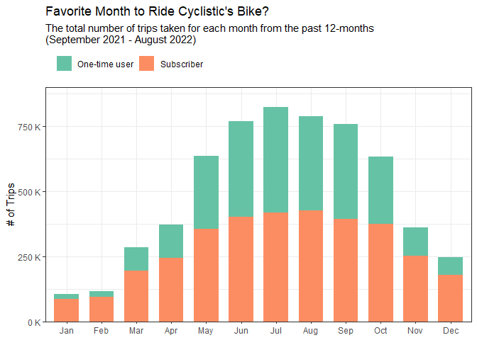
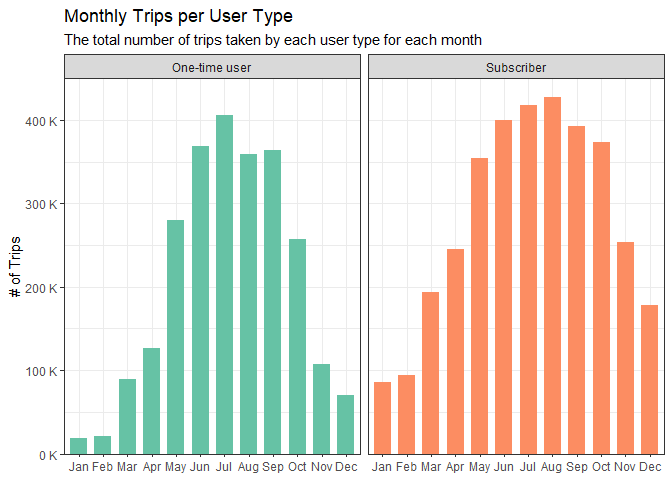
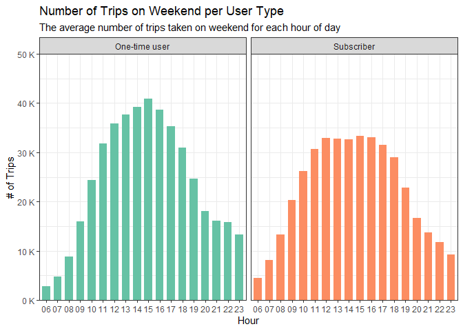

\
:camera: Clique Studio/Unsplash

## Introduction

This project is my attempt to solve the first case study from the
**Google Data Analytics Professional Certificate** **Capstone Projects**
on **Coursera** that you can access
[here](https://www.coursera.org/learn/google-data-analytics-capstone?specialization=google-data-analytics).
I really enjoy working on this project because not the challenge on this
project is ranging from the size of the data provided, to the working on
how to create a meaningful analysis to solve the main problem itself.

This project will be about **analyzing user behavior** on how they use
the service of a fictional bike-sharing company based in Chicago, called
**Cyclistic**.

If you have any question regarding this project, don’t hesitate to
contact me through email [here](mailto:taufik.achmad.septian@gmail.com),
or send me a message on LinkedIn
[here](https://www.linkedin.com/in/taufik-achmad/).

## Background

**Cyclistic** is a bike-sharing company that launched back in 2016.
Since then, the program has grown to a fleet of 5,824 bicycles that are
geo-tracked and locked into a network of 692 stations across Chicago.
The bikes can be unlocked from one station and returned to any other
station in the system at anytime.

Until now, Cyclistic’s marketing strategy relied on building general
awareness and appealing to broad consumer segments. One approach that
helped make these things possible was the flexibility of its pricing
plans: single-ride passes, full-day passes, and annual memberships.
**Customers who purchase single-ride or full-day passes are referred to
as one-time users**. **Customers who purchase annual memberships are
Cyclistic members or subscriber users**.

## Business Problem

Cyclistic’s finance analysts have concluded that annual members are much
more profitable than casual riders. Although the pricing flexibility
helps Cyclistic attract more customers, they believe that maximizing the
number of annual members will be key to future growth. Rather than
creating a marketing campaign that targets all-new customers, they
believe there is a very good chance to convert casual riders into
members. They notes that casual riders are already aware of the
Cyclistic program and have chosen Cyclistic for their mobility needs.

**They have set a clear goal:**

> **Design marketing strategies aimed at converting casual riders into
> annual members.**

In order to do that, however, the marketing analyst team needs to better
understand several things:

- **How do annual members and casual riders differ?**

- **Why casual riders would buy a membership?**

- **How digital media could affect their marketing tactics?**

The team is interested in analyzing the Cyclistic historical bike trip
data to identify trends. And for this project, I’m going to work to
answer the first question, which is:

> **How do annual members and casual riders differ?**

## Analysis

The data to support the analysis is coming from a real bike-sharing
company that is also based in Chicago called **Divvy**. The data have
been made available to be accessed publicly through this
[link](https://divvy-tripdata.s3.amazonaws.com/index.html).

The data is organized by monthly trip data in \*.csv format that is
compressed in a \*.zip format for each month. Meaning, each \*.csv file
contains the historical trip data for a specific month. For this
analysis, we’re going to need the historical trip data from the past 12
months, which means the trip data from **September 2021** to **August
2022** will be used.

### Trips per User Type

Let’s look at the number of trips taken by each user type for the past
12 months. Throughout this analysis, the annual members will be called
subscriber users and casual riders will be called one-time users. This
is done to help understanding the result better.

| user_type     | rides_num | percentage |
|:--------------|----------:|-----------:|
| Subscriber    |   3414493 |     58.04% |
| One-time user |   2468415 |     41.96% |

We can see that **subscriber users ride more bike for the past 12-month,
which are 58% or 17% higher than the one-time users**.

### Trips per Months

Let’s add some level of detail to show how the number of trips differ
per month.

<!-- -->

Here, we can see that the number of rides rose from January to July, and
continuously decreased after that. **The number of rides taken in June -
September is the highest throughout the year, with more than 750
thousand bike rides per month**, or **more than 50% of the total bike
rides are taken during these months**. Besides that, May and October
also have a quite high number of bike rides.

Looking at the individual user type can help us understand their
behavior on a monthly level.

<!-- -->

We can see conclude that:

1. There are more rides by the subscriber users each month.
2. Both user type has the same pattern in term of the number of bike
    ride they take each month.
3. The number of rides by one-time users increasing significantly on
    May.

### Trips per Day

Next, let’s see how each user type use their bike on daily level.

<!-- -->

We can see that there are high number of bike rides on weekend,
especially on Saturday. Other than that, the number of rides are quite
consistent along the week.

Next, let’s see the breakdown for each user type.

<!-- -->

From this visualization we can see that:

1. There are differences between each user type on how they use their
    bike on day-to-day basis. Along the week, more rides are taken by
    the subscriber users. Meanwhile, more rides are taken on the weekday
    by the one-time users.
2. The high number of rides by subscriber users along the week could
    possibly mean they use their bike to commute to the workplace.
3. The high number of rides by one-time users on the weekend could
    indicate that riders use their bike on this particular days for
    sightseeing.

### Trips per Hour

This analysis can give us an overview of what time of the day each user
type use their Cyclistic’s bike.

<!-- -->

The gradual increase of bike rides after 08:00 until 17:00 could
indicate the rides taken in this particular time are to commute to
workplace/school. The peaks at 08:00 and 17:00 could also support that
claim.

### Weekday vs. Weekend Analysis

From the day-to-day analysis, we can see that the number of trips taken
by the subscriber users is high during the week, while on the weekend
there are more trips taken by the one-time users.

Let’s breakdown the hourly result from the previous analysis to show how
each user type uses their bike on the weekday vs. on the weekend.

<!-- -->

The pattern for the weekday showing the same result as the previous
result on the number of trips per hour. On the other hand, the result
for the weekend trips shows the number of trips is gradually increasing
along the day and hit the peak at around 15:00.

We can look at each weekday and weekend result to better understand the
different. For the weekday, we can look at the chart below to understand
how each user type uses their bike.

<!-- -->

For the weekday, subscriber users take more trips than the one-time
users. Other than that, each user type have the same behavior. The peaks
at 08:00 and 17:00 and the gradual increase of bike rides between those
hours could possibly mean they use their bike to get to work/school.
Data on the age group of each riders could help to clarify this
statement.

For the weekend, we can look at the chart below to understand how each
user type uses their bike.

<!-- -->

For the weekend, the behavior on how each user types use their bike are
also the same. But not like on the weekday, the average number of rides
taken by the one-time users are higher especially after 10:00. The high
number of rides from both user types in middle of the day could indicate
that people use their bike for sightseeing.

The high number of trips taken by the one-time users even on the weekday
could support the claim that Cyclistic’s team made about casual users or
the one-time users awareness on their bike-sharing service.

### Trip Duration Analysis

First, let’s see the basic statistic on trip duration data after
removing outliers.

| average_duration_minutes | median_duration_minutes |
|-------------------------:|------------------------:|
|                 12.23652 |                9.933333 |

On average, each trips taken from the past 12-months data were about 12
minutes long.

<!-- -->

The density plot above is right skewed, meaning there are rides that are
far longer than the average rides duration.

Let’s now see the trip duration for each user type.

| user_type     | mean_trip_duration_min | median_trip_duration_min |
|:--------------|-----------------------:|-------------------------:|
| One-time user |               14.16656 |                    12.05 |
| Subscriber    |               10.99073 |                     8.70 |

Here we can see that even though the subscriber users ride the bike
more, the trip duration of one-time users are higher than them, which is
14 minutes per trips, whereas the average duration per trips for
subscriber users is about 10 minutes.

<!-- -->

By looking at the previous result on how each user type use their bike
on daily basis, this result should make sense. The high number of trips
by subscriber users along the week could indicate that they use their
bike to commute to work. Lower trip duration from the data above meaning
getting to their destination fast is their priority.

### Pick-up Location Analysis

Let’s analyze the popular bike pick-up location for each user type. I’m
going to use Tableau here to help showing the result.

From the visual above, we can conclude several things:

1. The top bike pick-up location for subscriber users are more
    distributed along each point. This can be seen by the size of each
    circle that has quite similar size with the other. Meanwhile, we can
    see several spots with circle that is larger than the other circles
    on the top pick-up locations for the one-time users.
2. The top pick-location are concentrated mainly on the south and the
    central area of the city.
3. The top pick-up location for one-time users are more concentrated
    towards the area where most of the city’s tourism attractions are
    located, which is on the central area. On the other hand, The top
    pick-up location for the subscriber users are more concentrated
    toward the western area of the city.
4. On the subscriber users’ result, the several spots on the bottom are
    located near the University of Chicago. This means, using bike
    sharing is quite popular for the college students.

## Result

Some actions/recommendations from this analysis are:

1. Perform marketing campaign on high trips months, which is from May -
    October.

2. Add subscription variation to include 6-months period subscription.

3. Create a special promotion price for university students.
